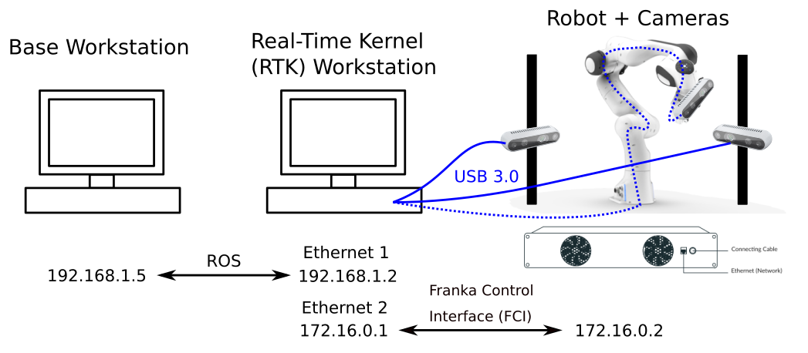

# Hardware Setup
This document describes the setup for real robot experiments with the Franka Emika Panda platform.

## Hardware Configuration
In our hardware configuration, we use two desktop PCs to split up functionality. The overall system architecture is shown below.



The **Real-Time Kernel (RTK) Workstation** acts as the official interface to the robot hardware. As described in the [Franka Emika documentation](https://frankaemika.github.io/docs/installation_linux.html#setting-up-the-real-time-kernel), Linux PCs using the Franka Controller Interface (FCI) must have a real-time kernel installed. Additionally, this machine handles the vision software nodes and is connected to both the robot and frame-mounted Intel RealSense cameras via USB 3.0.

The **Base Workstation** is a separate PC that need not run a real-time kernel, and interacts with the RTK workstation via the Robot Operating System (ROS), which requires an Ethernet connection. This machine runs the more computationally intensive programs such as the task and motion planner and the active learning pipelines.

---

## Software Setup
Clone this repository to both the RTK and base workstations, and follow the local installation process in [the installation README](./doc/installation.md).

If successful, both machines should have their own Catkin workspaces set up and be able to run simulation examples as shown in [the execution README](./doc/execution.md).

---

## Network Setup
As shown in our diagram, there are two separate network interfaces:
* The RTK workstation communicates with the robot via the FCI
* The RTK workstation communications with the base workstation via ROS

For both machines to communicate via ROS, you should modify the `~/.bashrc` files with the right IP addresses to allow bidirectional communication. Note that the ROS master must be on the RTK workstation because it is the machine that interfaces with the robot. Taking the addresses shown in our diagram, ensure the following environment variables are set.

**Base Workstation:**
```
export ROS_IP=192.168.1.5
export ROS_MASTER_URI=http://192.168.1.2:11311
```

**RTK Workstation:**
```
export ROS_IP=192.168.1.2
export ROS_MASTER_URI=http://192.168.1.2:11311
```

Additionally, on the RTK workstation, we must set up our IP addresses for the FCI. The `franka_ros` package we are using will contain a [`franka.sh`](https://github.com/rachelholladay/franka_ros_interface/blob/master/franka.sh) utility script. 

Modify this so that `FRANKA_ROBOT_IP` points to your robot's IP address (usually `172.16.0.2`) and `ROS_MASTER_IP` points to your PC's IP address on the Ethernet device that communicates with the base workspace (in our diagram, `172.168.1.2`).

---

## RTK Workstation Commands
First, connect to the robot by starting up the FCI, unlocking the joints, and disabling the emergency stop.

Then, start the Franka interface.
```
cd ~/catkin_ws
./franka.sh master
roslaunch franka_interface interface.launch
```

You can open an interactive Python console to reset the robot position and/or error state, among other useful commands.
```
roscd franka_interface/scripts
python3 -i interactive.py
>> arm.move_to_neutral()
>> arm.resetErrors()
```

Start the vision server, which will localize and identify blocks in the scene.
```
roslaunch panda_vision vision.launch
```

Start the Panda agent server, which will receive commanded towers from the active learning pipeline and request plans from the planning server.
```
rosrun stacking_ros panda_agent_server.py --num-blocks 10 --real --use-vision
```

---

## Base Workstation Commands

The base workstation will be running any active learning, task and motion planning, and additional visualization/analysis software. More details are available in [the execution README](./doc/execution.md).

The minimal set of commands to reproduce our active learning experiment involve hosting the planning server and starting active learning from scratch.

```
python3 stacking_ros/scripts/planning_server.py --blocks-file learning/domains/towers/final_block_set_10.pkl --use-vision --alternate-orientations --num-blocks 10 --max-tries 2 

python3 -m learning.experiments.active_train_towers --exec-mode real --use-panda-server --block-set-fname learning/domains/towers/final_block_set_10.pkl --n-epochs 20 --n-acquire 10 --sampler sequential --exp-name robot-seq-init-sim --n-samples 100000
```

You will also likely need to restart active learning at some point.

```
python3 -m learning.experiments.restart_active_train_towers --exp-path learning/experiments/logs/exp-20210218-161131
```

---

## Tips and Troubleshooting
Since the Franka Control Interface (FCI) relies on a real-time kernel, additional care is needed to ensure that enough computational resources are allocated to this interface. Some practical tips we have found are:

* Make sure that your RTK is set to "Performance" mode using the toolbar icon on your OS.
* Ensure that you have no additional processes running on the RTK workstation. In particular, close your Web browsers after connecting to your robot, especially if you are using Google Chrome.
* Use the [`taskset`](https://man7.org/linux/man-pages/man1/taskset.1.html) utility to constrain other ROS nodes (i.e., vision and Panda agent server) to use a specific subset of processor cores. For example:

```
taskset --cpu-list 0,1 roslaunch panda_vision vision.launch

taskset --cpu-list 2,3,4,5 rosrun stacking_ros panda_agent_server.py --num-blocks 10 --real --use-vision
```